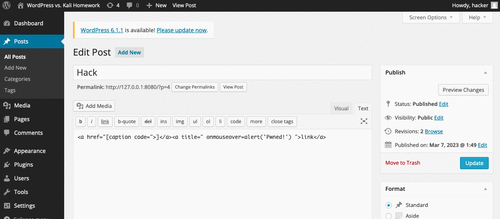
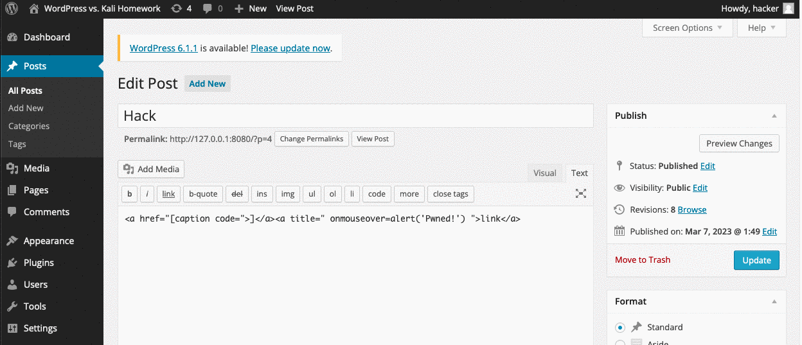
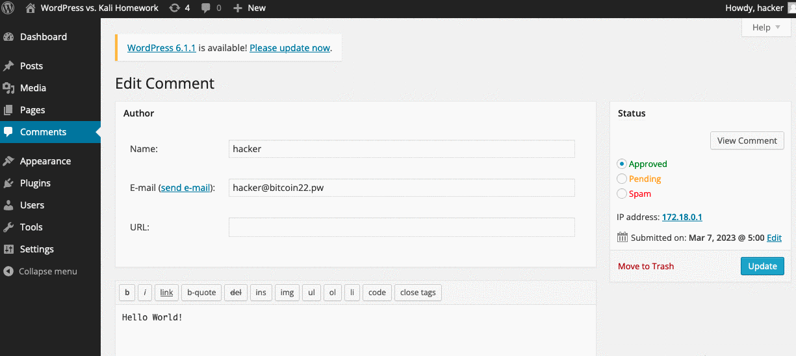

# Project 7 - WordPress Pen Testing

Time spent: **5** hours spent in total

> Objective: Find, analyze, recreate, and document **five vulnerabilities** affecting an old version of WordPress

## Pen Testing Report

### 1. (Required) Authenticated Stored Cross-Site Scripting (XSS)

- [X] Summary: 
  - Vulnerability types: XSS
  - Tested in version: 4.2.2
  - Fixed in version: 4.3.2
- [X] GIF Walkthrough: 
- [X] Steps to recreate: Become administrator aka "hacker" account, then use the exploit by inserting this malicious script into the post: ```<a href="[caption code=">]</a><a title=" onmouseover=alert('Pwned!')  ">link</a>```
- [X] Affected source code:
  - [Link 1](https://klikki.fi/wordpress-core-stored-xss)
  
### 2. (Required) XSS vulnerability in Page's Edit-page

- [X] Summary: 
  - Vulnerability types: XSS
  - Tested in version: 4.2.2
  - Fixed in version: 4.7.1
- [X] GIF Walkthrough: 
- [X] Steps to recreate: Go to the post title and paste this code ```  ```
- [] Affected source code: 


### 3. (Required) XSS vulnerability in comment section using SVG onload

- [X] Summary: 
  - Vulnerability types: XSS
  - Tested in version: 4.2.2
  - Fixed in version: 4.7.0
- [X] GIF Walkthrough: 
- [X] Steps to recreate: comment on a post this code: ```<svg/onload=alert('Hacked!')>```
- [] Affected source code: 


## Resources

- [WordPress Source Browser](https://core.trac.wordpress.org/browser/)
- [WordPress Developer Reference](https://developer.wordpress.org/reference/)

## Notes

When i was attempting to exploit the wordpress vulnerabilities, I found that the
exploits were similar to ones found online. However, there were some differences
in my own implementation compared to those found online. My implementation is original because i have tried attempting this many times.

## License

    Copyright [2023] [Luciano Scarpaci]

    Licensed under the Apache License, Version 2.0 (the "License");
    you may not use this file except in compliance with the License.
    You may obtain a copy of the License at

        http://www.apache.org/licenses/LICENSE-2.0

    Unless required by applicable law or agreed to in writing, software
    distributed under the License is distributed on an "AS IS" BASIS,
    WITHOUT WARRANTIES OR CONDITIONS OF ANY KIND, either express or implied.
    See the License for the specific language governing permissions and
    limitations under the License.
